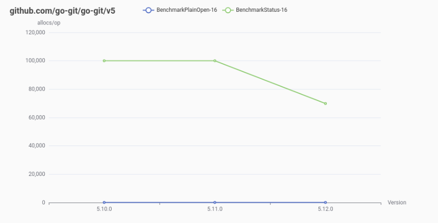
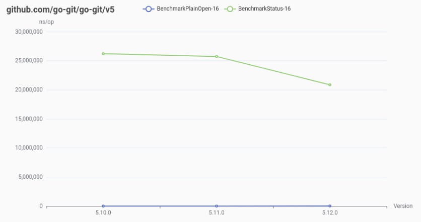

# benchr

**benchr** is a command-line tool designed to run a set of Go benchmark tests across different versions of the target project, generating charts with the trends over time. It is ideal for developers looking to measure performance regressions or improvements across different versions of their projects.

## Key Features

- **Version Comparison:** Run benchmarks for specified versions of a system under test.
- **Automated Chart Generation:** Visualize benchmark results with an easy-to-understand plot.
- **Lightweight and Simple:** No additional dependencies required for chart generation or version management.

## Installation

Use `go install`:
```bash
go install github.com/pjbgf/benchr/cmd/benchr@latest
```

## Usage

### Basic Command Structure

```bash
benchr -path <path_to_benchmarks> -target <target_dependency> -versions <version1,version2,...> [options]
```

### Example

Let’s say the system under test is `go-git`. You want to benchmark versions
`v5.10.0`, `v5.11.0`, and `v5.12.0` and generate charts for both `ns/op` and
`allocs/op`. The [benchmark tests](example/bench_test.go) used can be found
in the [example](example) dir.

```bash
$ benchr -path ./example -target github.com/go-git/go-git/v5 -versions v5.10.0,v5.11.0,v5.12.0 -allocs build/allocs.html -ns build/ns.html

2024/12/28 09:00:16 INFO start benchmark ref=v5.10.0
goos: linux
goarch: amd64
pkg: github.com/pjbgf/bench/example
cpu: AMD Ryzen 7 PRO 8840HS w/ Radeon 780M Graphics
BenchmarkPlainOpen-16    	  112645	     10288 ns/op	    2880 B/op	      44 allocs/op
BenchmarkStatus-16       	      44	  26230576 ns/op	23604316 B/op	  100049 allocs/op
PASS
ok  	github.com/pjbgf/bench/example	5.012s
2024/12/28 09:00:21 INFO start benchmark ref=v5.11.0
goos: linux
goarch: amd64
pkg: github.com/pjbgf/bench/example
cpu: AMD Ryzen 7 PRO 8840HS w/ Radeon 780M Graphics
BenchmarkPlainOpen-16    	  116508	     10189 ns/op	    2912 B/op	      44 allocs/op
BenchmarkStatus-16       	      39	  25752164 ns/op	23610350 B/op	  100060 allocs/op
PASS
ok  	github.com/pjbgf/bench/example	4.610s
2024/12/28 09:00:26 INFO start benchmark ref=v5.12.0
goos: linux
goarch: amd64
pkg: github.com/pjbgf/bench/example
cpu: AMD Ryzen 7 PRO 8840HS w/ Radeon 780M Graphics
BenchmarkPlainOpen-16    	  115477	     10359 ns/op	    2912 B/op	      44 allocs/op
BenchmarkStatus-16       	      50	  20873449 ns/op	19499412 B/op	   69891 allocs/op
PASS
ok  	github.com/pjbgf/bench/example	3.893s
```

With the generated charts:



## License

This project is licensed under the Apache 2 License. See the [LICENSE](LICENSE) file for details.
